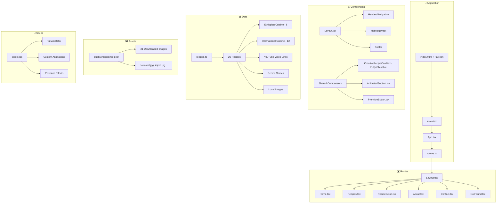
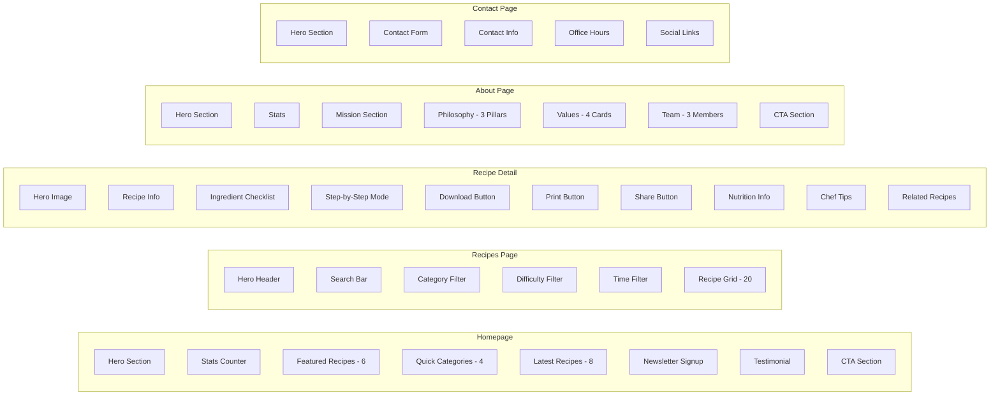
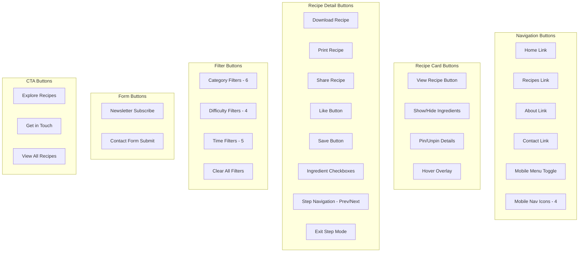
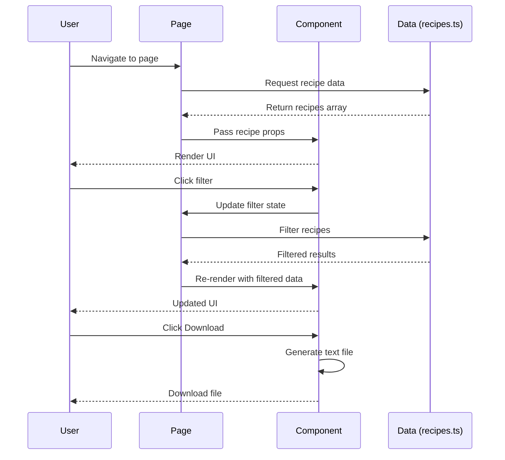

# Abstract - Project Architecture

## 🗂️ Project Structure Diagram



## 📄 Pages Overview



## 🔘 Buttons & Interactive Elements



## 📊 Data Flow



## 📁 File Structure

```
Abstract/
├── index.html                 # Entry HTML
├── package.json               # Dependencies
├── README.md                  # Documentation
├── ARCHITECTURE.md            # This file
├── vite.config.ts             # Vite config
├── tailwind.config.ts         # Tailwind config
├── src/
│   ├── main.tsx               # React entry
│   ├── styles/
│   │   └── index.css          # Global styles
│   └── app/
│       ├── App.tsx            # Root component
│       ├── routes.ts          # Route definitions
│       ├── components/
│       │   ├── Layout.tsx     # Main layout
│       │   ├── MobileNav.tsx  # Mobile navigation
│       │   ├── CreativeRecipeCard.tsx
│       │   ├── AnimatedSection.tsx
│       │   └── PremiumButton.tsx
│       ├── pages/
│       │   ├── Home.tsx
│       │   ├── Recipes.tsx
│       │   ├── RecipeDetail.tsx
│       │   ├── About.tsx
│       │   ├── Contact.tsx
│       │   └── NotFound.tsx
│       ├── data/
│       │   └── recipes.ts     # 20 recipes
│       └── hooks/
│           └── useScrollReveal.ts
└── dist/                      # Build output
```

## 📈 Statistics

| Category | Count |
|----------|-------|
| **Pages** | 6 |
| **Components** | 8 |
| **Recipes** | 20 |
| **Ethiopian Recipes** | 8 |
| **International Recipes** | 12 |
| **YouTube Video Links** | 8 |
| **Local Images** | 21 |
| **Recipe Stories** | 8 |
| **Interactive Buttons** | 40+ |
| **Filter Options** | 15 |
| **Animations** | 10+ |
| **Featured Recipes (Home)** | 9 |

## 🎯 Features Checklist

- ✅ Homepage with hero, 9 featured recipes, categories, newsletter
- ✅ Recipe archive with advanced filters
- ✅ Single recipe page with full details
- ✅ Interactive ingredient checklist
- ✅ Step-by-step cooking mode
- ✅ Recipe download functionality
- ✅ Print recipe functionality
- ✅ YouTube video tutorials for recipes
- ✅ Recipe stories and origin tales
- ✅ Local downloaded images (21 images)
- ✅ Fully clickable recipe cards
- ✅ Custom favicon with Abstract logo
- ✅ Share recipe functionality
- ✅ Mobile bottom navigation
- ✅ Responsive design
- ✅ Premium animations
- ✅ Ethiopian contact info
- ✅ Copyright and licensing
- ✅ Ready for Cloudflare deployment

---

© 2025 Abstract. All rights reserved.
Made in Addis Ababa, Ethiopia 🇪🇹
