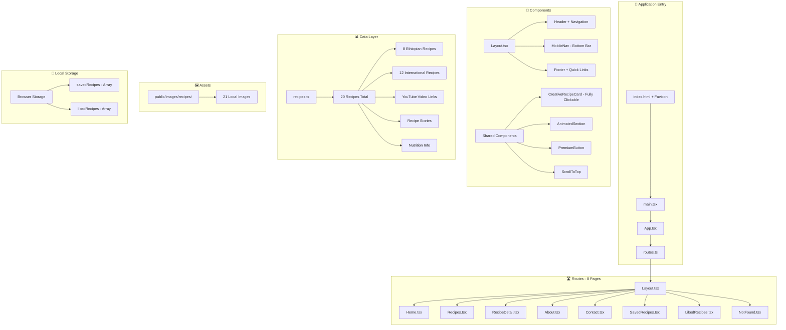
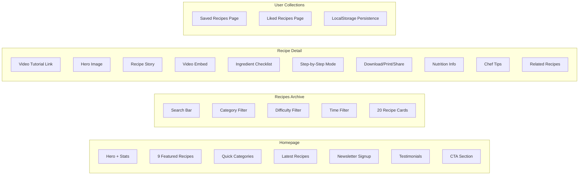
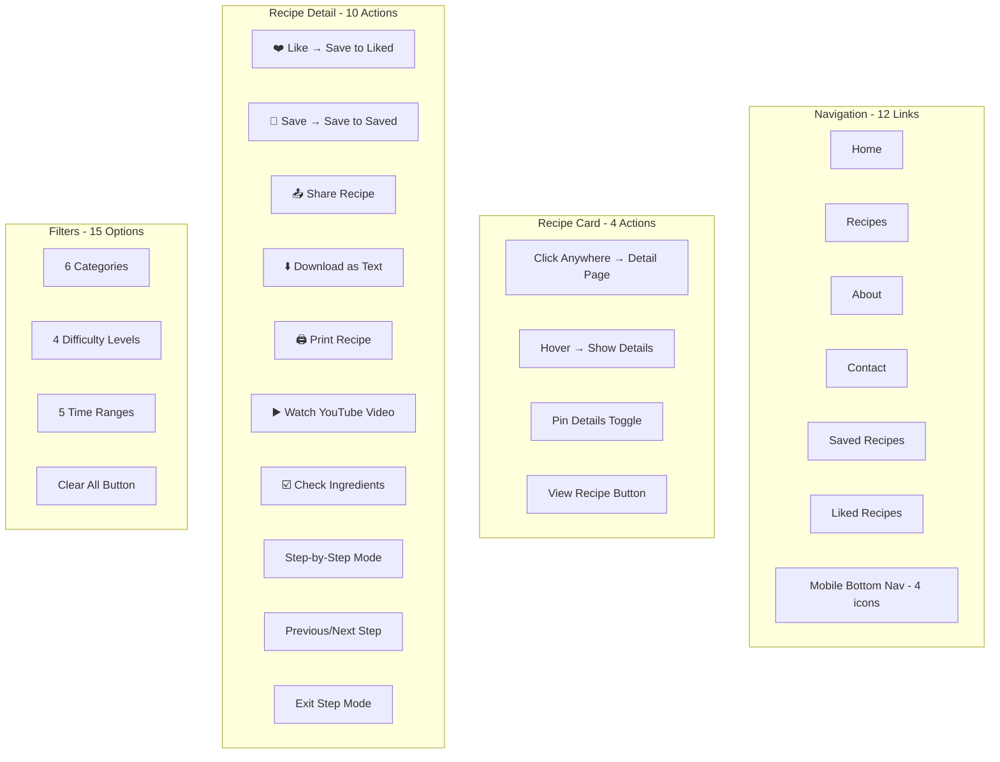

# Abstract - Premium Culinary Experience

🌐 **Live Demo**: [https://abstract-82t.pages.dev/](https://abstract-82t.pages.dev/)

A modern, responsive recipe website featuring Ethiopian and international cuisine with beautiful animations, YouTube video tutorials, and premium design.

---

## 🗂️ Project Architecture



---

## 📄 Pages Flow Diagram



---

## 🔘 Interactive Elements



---

## 🚀 Features

### Core Features
- ✅ **20 Recipes** - 8 Ethiopian + 12 International
- ✅ **YouTube Video Tutorials** - Watch cooking videos
- ✅ **Recipe Stories** - Origin and cultural background
- ✅ **Interactive Ingredient Checklist** - Mark items as you cook
- ✅ **Step-by-Step Mode** - Focus on one instruction
- ✅ **Download & Print** - Save recipes offline

### User Collections
- ✅ **Save Recipes** - Bookmark for later (persisted in browser)
- ✅ **Like Recipes** - Mark favorites (persisted in browser)
- ✅ **Dedicated Pages** - View all saved/liked recipes

### Navigation
- ✅ **Desktop Header** - Full navigation with hamburger menu
- ✅ **Mobile Bottom Nav** - Quick access to Home, Recipes, Saved, Liked
- ✅ **Footer Links** - All pages accessible

### Design
- ✅ **Fully Responsive** - Mobile, Tablet, Desktop
- ✅ **Premium Animations** - Scroll reveals, hover effects
- ✅ **Custom Favicon** - Abstract "A" logo
- ✅ **Ethiopian Branding** - Addis Ababa contact info

---

## 📱 Pages (8 Total)

| Page | Route | Description |
|------|-------|-------------|
| **Home** | `/` | Hero, 9 featured recipes, categories, newsletter |
| **Recipes** | `/recipes` | Full archive with filters |
| **Recipe Detail** | `/recipe/:id` | Complete recipe with video, story, ingredients |
| **About** | `/about` | Team, philosophy, values |
| **Contact** | `/contact` | Form and contact info |
| **Saved** | `/saved` | User's bookmarked recipes |
| **Liked** | `/liked` | User's favorite recipes |
| **404** | `*` | Not found page |

---

## 🛠️ Tech Stack

| Technology | Purpose |
|------------|---------|
| **React 18** | UI Framework |
| **TypeScript** | Type Safety |
| **TailwindCSS 4** | Styling |
| **Vite** | Build Tool |
| **React Router 7** | Navigation |
| **Lucide React** | Icons |
| **LocalStorage** | Data Persistence |

---

## 📦 Installation

```bash
# Clone repository
git clone https://github.com/black12-ag/Abstract.git
cd Abstract

# Install dependencies
npm install

# Start development server
npm run dev

# Build for production
npm run build

# Preview production build
npm run preview
```

---

## 🌐 Deployment

**Live Site**: [https://abstract-82t.pages.dev/](https://abstract-82t.pages.dev/)

### Deploy to Cloudflare Pages
1. Connect GitHub repository
2. Build command: `npm run build`
3. Output directory: `dist`
4. Deploy!

Also compatible with: **Vercel**, **Netlify**

---

## 📊 Statistics

| Category | Count |
|----------|-------|
| Pages | 8 |
| Recipes | 20 |
| Ethiopian Recipes | 8 |
| International Recipes | 12 |
| YouTube Videos | 8 |
| Local Images | 21 |
| Recipe Stories | 8 |
| Interactive Buttons | 50+ |
| Filter Options | 15 |

---

## 📍 Contact

**Abstract - Culinary Excellence**

- 📧 Email: info@abstract.et
- 📱 Phone: +251 91 123 4567
- 📍 Location: Bole Road, Addis Ababa, Ethiopia

---

## 📄 License

MIT License - © 2025 Abstract. All rights reserved.

---

Made with ❤️ in Addis Ababa, Ethiopia 🇪🇹